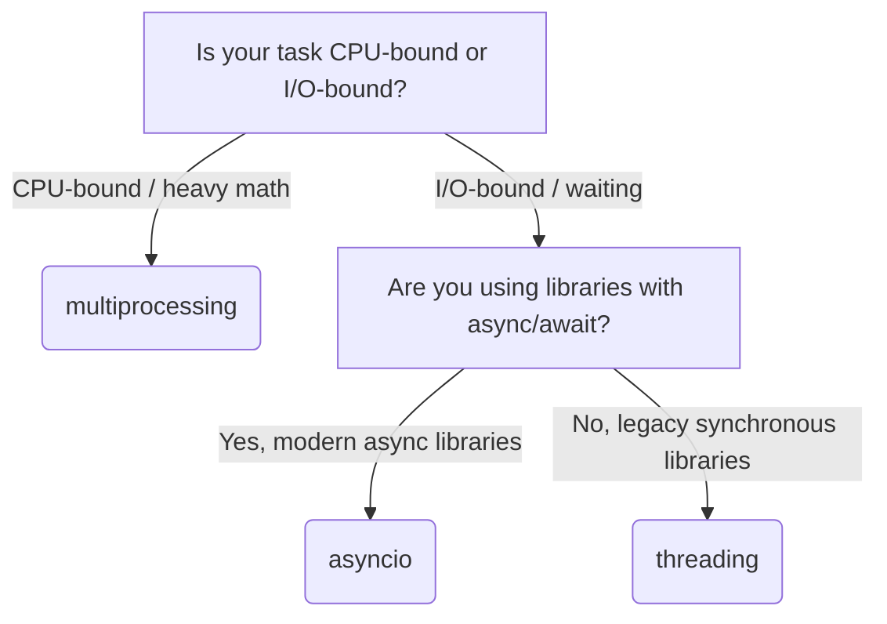

# Python Concurrency: asyncio vs. threading vs. multiprocessing

Choosing the right tool depends on whether your program is **I/O-Bound** (waiting for network, disk, or databases) or **CPU-Bound** (doing heavy calculations).

---

## 1. Summary Matrix

| Tool | Focus | GIL Blocked? | Context Switch Cost | Best For |
| :--- | :--- | :--- | :--- | :--- |
| **`asyncio`** | Non-blocking I/O | **No** (releases control voluntarily) | Extremely Low (Single-thread) | Thousands of fast, network-heavy connections. |
| **`threading`** | Blocking I/O | **Partially** (releases GIL on low-level system I/O) | Medium (OS thread switching) | A few blocking tasks or keeping UI responsive. |
| **`multiprocessing`**| CPU Calculations | **No** (each process gets its own GIL) | High (Spawning separate processes) | Math, data processing, and multi-core operations. |

---

## 2. Practical Use Cases

### 🌐 Use `asyncio` when:
You are waiting on **network I/O** and need to scale to **hundreds or thousands of concurrent connections**. 
*   **Web Scraping / Crawling**: Fetching data from 5,000 websites concurrently.
*   **Web APIs / Chat Servers**: Building high-performance backends (e.g., FastAPI, WebSockets) that handle massive numbers of open connections.
*   **API Gateways**: An API that serves a request by querying 5 different microservices at the same time.
*   **IoT Brokers**: A server that listens to data streams from thousands of connected sensors.

### 🧵 Use `threading` when:
You are waiting on **I/O**, but you are using **legacy synchronous libraries** (no `async/await` support), or you only have a **few tasks**.
*   **Desktop App GUIs**: Keeping a Tkinter/PyQt window responsive (clickable) while a background thread downloads a file or runs a task.
*   **Synchronous Worker Daemons**: Running a background worker that fetches from a queue and makes database calls using traditional synchronous database adapters.
*   **GIL-Releasing Libraries**: Running computations using libraries written in C/C++ or Rust (e.g., NumPy, OpenCV, PyTorch, TensorFlow) which explicitly release the GIL during heavy work.

### 🖥️ Use `multiprocessing` when:
Your code is **CPU-Bound** (doing calculations) and you want to use **all CPU cores** on your computer.
*   **Data Processing**: Parsing 100 huge CSV or JSON files. You can process 8 files at a time on an 8-core CPU.
*   **Media Editing**: Encoding video, converting 10,000 images, or applying audio filters.
*   **Math & Science**: Running Monte Carlo simulations, complex physics engines, or brute-forcing algorithms.
*   **Machine Learning (CPU)**: Doing inference or grid-searching hyperparameters over large data sets.

---

## 3. Simple Decision Flowchart



---

## 4. Modern & Alternative Ecosystem Libraries

While the built-in modules cover most scenarios, several third-party libraries solve these challenges with cleaner APIs or higher performance.

### 🦦 Trio (Structured Concurrency)
An alternative to `asyncio` that focuses on safety and usability via **Structured Concurrency**. Trio introduces the concept of "nursery" blocks. You cannot spawn a background task that outlives the scope it was created in.
*   **Why it's better**: If a background task in `asyncio` crashes, it might fail silently (become a "zombie" task). In Trio, if a child task crashes, the nursery forces all sibling tasks to cancel and propagates the error up.
```python
import trio

async def main():
    async with trio.open_nursery() as nursery:
        nursery.start_soon(fetch_url, "url1")
        nursery.start_soon(fetch_url, "url2")
    # Code only reaches here once both fetch_url tasks are completely finished!
```

### 🌉 AnyIO (The Bridge)
A compatibility layer that lets you write async code that runs on top of either `asyncio` or `trio`. Major modern frameworks like **FastAPI** and **Starlette** use AnyIO under the hood.

### ⚡ uvloop (Extreme Performance)
A drop-in replacement for Python's built-in `asyncio` event loop. Written in Cython on top of `libuv` (the C library powering Node.js).
*   **Why use it**: Adding two lines of code speeds up standard `asyncio` programs by **2x to 4x**, matching Node.js/Go performance.
```python
import uvloop
import asyncio

# Set uvloop as the default event loop
uvloop.install()
asyncio.run(main())
```

### 🔮 concurrent.futures (Standard Library Wrapper)
A modern standard library module providing a clean high-level interface (`ThreadPoolExecutor` and `ProcessPoolExecutor`) for executing code asynchronously using pools.
```python
from concurrent.futures import ThreadPoolExecutor

with ThreadPoolExecutor(max_workers=3) as executor:
    results = executor.map(fetch_page, ["url1", "url2", "url3"])
```

### 💼 Joblib (Data Science Parallelism)
A library designed to make running parallel loops simple and efficient. It is a core dependency of **Scikit-Learn** and handles process spawning, auto-batching, and memory-mapping of large numpy arrays under the hood.
```python
from joblib import Parallel, delayed

# Run heavy_math on 10 inputs spread across 4 CPU cores
results = Parallel(n_jobs=4)(delayed(heavy_math)(i) for i in range(10))
```
