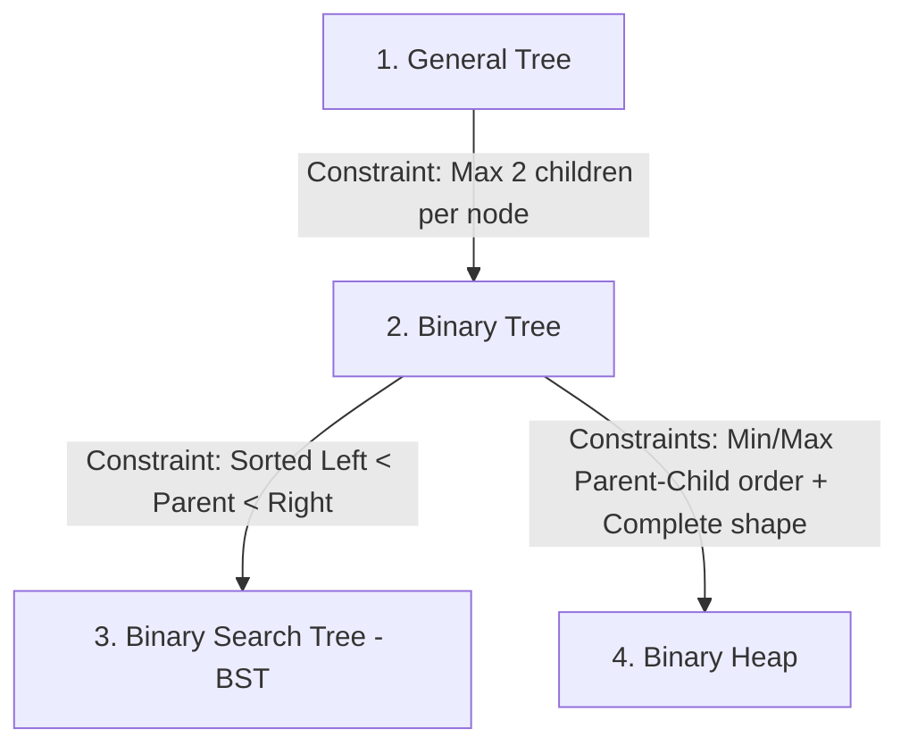

# Python Collections & Data Structures

Python offers a variety of built-in collections and specialized structures in the `collections` module. Selecting the right collection optimizes both memory usage and runtime performance.

---

## 1. Built-in Collections

| Collection | Syntax | Ordered? | Mutable? | Unique Only? | Best Used For |
| :--- | :--- | :--- | :--- | :--- | :--- |
| **List** | `[a, b]` | Yes | **Yes** | No | Standard dynamic arrays, sequential data. |
| **Tuple** | `(a, b)` | Yes | **No** | No | Immutable records (e.g., GPS coordinates `(lat, lon)`), dictionary keys. |
| **Set** | `{a, b}` | No | **Yes** | **Yes** | Fast membership testing, deduplication, mathematical set operations. |
| **Dict** | `{k: v}` | Yes* | **Yes** | Keys: **Yes** | Key-value lookups, mappings, JSON-like data. |

*\*Note: Dictionaries maintain insertion order starting in Python 3.7+.*

---

## 2. Advanced Collections (`collections` module)

For specialized tasks, Python’s built-in `collections` module provides optimized data structures:

### 🔄 `deque` (Double-Ended Queue)
*   **What it is**: A list-like container optimized for fast appends and pops from both ends.
*   **Why use it**: Inserting or removing elements at the beginning of a standard Python list takes $O(n)$ time because all subsequent elements must be shifted in memory. A `deque` does this in $O(1)$ time.
```python
from collections import deque

q = deque(["task1", "task2"])
q.append("task3")      # O(1) append to right
q.appendleft("task0")  # O(1) append to left
first = q.popleft()    # O(1) pop from left ("task0")
```

### 🗝️ `defaultdict`
*   **What it is**: A dictionary subclass that calls a factory function to supply missing values automatically.
*   **Why use it**: Prevents tedious `KeyError` checking when initializing empty structures like lists or counters inside dictionary keys.
```python
from collections import defaultdict

# Automatically initializes missing keys with an empty list
grouped_data = defaultdict(list)
grouped_data["users"].append("Alice") # No need to check if "users" key exists first!
```

### 🧮 `Counter`
*   **What it is**: A dictionary subclass for counting hashable objects.
*   **Why use it**: Cleanly counts occurrences of elements in collections without manual loops.
```python
from collections import Counter

counts = Counter("abracadabra")
print(counts)  # Counter({'a': 5, 'b': 2, 'r': 2, 'c': 1, 'd': 1})
print(counts.most_common(2))  # [('a', 5), ('b', 2)]
```

### 🏷️ `namedtuple`
*   **What it is**: Factory function for creating tuple subclasses with named fields.
*   **Why use it**: Adds readability to tuples by allowing field access by name instead of index, without the memory overhead of a full class.
```python
from collections import namedtuple

Point = namedtuple("Point", ["x", "y"])
p = Point(11, y=22)
print(p.x, p.y)  # 11 22
```

---

## 3. Time Complexity Reference

Choosing the correct data structure can mean the difference between an algorithm running in milliseconds vs. minutes:

| Operation | List | Deque | Set | Dict |
| :--- | :--- | :--- | :--- | :--- |
| **Append / Push (Right)** | $O(1)$ | $O(1)$ | $O(1)$ | $O(1)$ |
| **Insert / Pop (Left)** | $O(n)$ | $O(1)$ | N/A | N/A |
| **Membership Check (`x in col`)** | $O(n)$ | $O(n)$ | $O(1)$ | $O(1)$ (Keys) |
| **Access by Index (`col[i]`)** | $O(1)$ | $O(n)$ | N/A | N/A |
| **Delete Element** | $O(n)$ | $O(n)$ | $O(1)$ | $O(1)$ |

---

## 4. Priority Queue / Binary Heap (`heapq` module)

*   **What it is**: An implementation of the binary heap algorithm (specifically a min-heap) that operates directly on standard Python lists.
*   **Why use it**: Allows you to retrieve the smallest element in constant time $O(1)$, and insert/delete elements in logarithmic time $O(\log n)$. Useful for priority queues, schedule tracking, or finding the $k$ smallest/largest items.

### Core Functions:
```python
import heapq

heap = []
heapq.heappush(heap, 10)  # O(log n) - Push item onto the heap
heapq.heappush(heap, 5)

smallest = heapq.heappop(heap) # O(log n) - Pop the smallest item (5)
# heap[0] is always the smallest element in O(1) time
```

### Min-Heap vs. Max-Heap

Python's `heapq` is hardcoded as a **Min-Heap** (root is always the minimum). 

#### How to force a Max-Heap in Python:
To get a Max-Heap (where the root is always the maximum), you **multiply your numbers by `-1`** when pushing, and multiply by `-1` again when popping:
```python
max_heap = []
# We want to push 10, then 5, then 20
heapq.heappush(max_heap, -10)
heapq.heappush(max_heap, -5)
heapq.heappush(max_heap, -20)

# Pop returns the smallest stored value (-20), which negated is the max value (20)
largest = -heapq.heappop(max_heap)  # Returns 20
```

#### Use Cases:
*   **Min-Heap**: Schedulers (earliest time first), Dijkstra's Shortest Path algorithm (shortest distance first), merging multiple sorted streams.
*   **Max-Heap**: Priority queues where higher numbers represent higher priority (e.g., job processing queues), finding the $k$ smallest items in a large stream, or calculating streaming medians.

---

## 5. Binary Heap vs. Binary Search Tree (BST)

A Binary Heap is not the same as a standard Binary Search Tree:

### The Rules of a Binary Heap:
It is **not** about the sum of the nodes. It is a strict inequality comparison:
1.  **The Heap Property**: 
    *   **Min-Heap**: `Parent <= Left Child` AND `Parent <= Right Child`.
    *   **Max-Heap**: `Parent >= Left Child` AND `Parent >= Right Child`.
    *   *Note*: There is no left-to-right sorting. The left child can be larger or smaller than the right child.
2.  **The Shape Property**: The tree must be **complete** (all levels filled except possibly the bottom level, which is filled left-to-right). This completeness is why a heap can be represented as a simple flat list (`heap[i]`) without using pointer nodes.

### Heap vs. Binary Search Tree (BST)

| Feature | Binary Heap | Binary Search Tree (BST) |
| :--- | :--- | :--- |
| **Ordering Rule** | Parent compared to children (no left vs right rule). | Left Child < Parent < Right Child. |
| **Search Time** | $O(n)$ (not optimized for arbitrary search). | $O(\log n)$ (optimized to find any element). |
| **Min/Max Retrieval** | $O(1)$ (always at the root). | $O(\log n)$ (traverse to the far left/right). |
| **Memory Representation** | Flat array/list (no pointer overhead). | Node objects linked by pointers. |

---

## 6. Binary Search Trees (BST) in Practice

Unlike heaps, Python does **not** have a built-in BST module (like a Red-Black Tree or AVL Tree) in its standard library. 

### Python Alternatives for Sorted Data
If you need sorted data structures in Python, you use these standard or third-party alternatives:
1.  **`bisect` module (Standard Library)**: Keeps a standard Python `list` sorted using binary search. Note that inserting an item is still $O(n)$ because shifting list elements in memory is slow.
2.  **`sortedcontainers` (Third-party library)**: A popular, fast, pure-Python library that provides `SortedList`, `SortedDict`, and `SortedSet` structures.

*Note: Other languages have built-in BSTs. For example, Java's `TreeMap`/`TreeSet` and C++'s `std::map`/`std::set` are built using self-balancing Red-Black BSTs.*

### Where are Search Trees used in practice?

Multi-way self-balancing search trees (generalizations of BSTs called **B-Trees** and **B+ Trees**) are the backbone of modern computer systems:

1.  **Database Indexes**: Databases like PostgreSQL, MySQL, and SQLite use B-Trees to index tables. If you search for users with `age > 30`, the database uses a search tree to find matching records in $O(\log n)$ time instead of scanning every row in the database ($O(n)$).
2.  **File Systems**: Operating system file systems (like NTFS on Windows, ext4 on Linux, and APFS on macOS) use B-Trees to map directory names and file paths to physical sectors on your hard drive/SSD.
3.  **Range Queries**: Unlike hash tables (dictionaries), which cannot find ranges efficiently, search trees keep keys in sorted order. This makes it extremely fast to run queries like: *"Find all items valued between $10 and $50."*

---

## 7. Time Complexity Intuition: $O(n)$ vs. $O(\log n)$

Understanding how to spot these two complexities in code is crucial for algorithm design:

### 1. Spotting $O(n)$ (Linear Time)
*   **The Rule**: You must look at (or process) **every single element** in the input dataset.
*   **If input doubles**: The number of execution steps doubles.
*   **What it looks like in code**:
    *   Simple loops: `for item in database:` or `while i < len(lst): i += 1`.
    *   Sequential search on unsorted data: `if target in my_list:`.
    *   Shifting elements: `my_list.insert(0, val)` (because Python must touch and move every element to the right by one slot).

### 2. Spotting $O(\log n)$ (Logarithmic Time)
*   **The Rule**: At each step, the algorithm **divides the remaining work in half** (or by another constant fraction). It never looks at the vast majority of elements.
*   **If input doubles**: The number of steps increases by **exactly one** extra step.
*   **What it looks like in code**:
    *   **Dividing loops**: The loop variable is divided or multiplied at each iteration, rather than incremented:
        ```python
        while n > 1:
            n = n // 2  # Discarding half the problem at every step
        ```
    *   **Binary Search**: Checking the middle element of a sorted list, then ignoring either the entire left half or right half.
    *   **Tree Traversals (Heaps & BSTs)**: Starting at the root and moving down to a leaf. Because a balanced tree has a height of roughly $\log_2(n)$, moving from the top to the bottom takes at most $\log_2(n)$ steps. (This is why `heapq.heappush` and `heapq.heappop` are $O(\log n)$).

### ⚠️ Common Confusion: Two-Pointer vs. Binary Search
While both techniques use two pointers (`left` and `right` or `low` and `high`), their time complexities are different:

*   **Standard Two-Pointer** (e.g., Two Sum on sorted array, Container with Most Water): **$O(n)$**
    *   *Why*: At each step, pointers move by exactly **one index** (`left += 1` or `right -= 1`). The total distance the pointers cover is $n$, meaning you inspect elements linearly.
*   **Binary Search**: **$O(\log n)$**
    *   *Why*: At each step, you jump to the **midpoint** (`mid = (left + right) // 2`) and discard half of the search range. The distance between the pointers shrinks exponentially, not linearly.

---

## 8. Interview Guide: Priority Queue vs. Heap

If an interviewer asks you about heaps or priority queues, here is the exact terminology and distinction you should present:

### 1. The Core Distinction: ADT vs. Data Structure
*   **Priority Queue is an Abstract Data Type (ADT)**: It is a *logical specification*. It describes **what** the collection does, not *how* it does it. It specifies that elements have priorities, and you can add elements and pop the one with the highest priority.
*   **Heap is a Concrete Data Structure**: It is a *physical implementation*. It is the most common and efficient way to build/implement a Priority Queue.

> **Analogy**: A "Car" is an abstract concept (it gets you from A to B). A "Tesla Model 3" is a concrete implementation of a car. A Priority Queue is the car; a Heap is the Tesla.

### 2. How else could you build a Priority Queue?
If asked if a Heap is the *only* way to build a Priority Queue, explain these options to show deep understanding:
*   **Unsorted List**: Push is $O(1)$ (just append). Pop is $O(n)$ (must search the list for the highest priority).
*   **Sorted List**: Push is $O(n)$ (must find slot and shift elements). Pop is $O(1)$ (just pop from the end).
*   **Binary Search Tree (BST)**: Push is $O(\log n)$. Pop is $O(\log n)$. (But has pointer overhead).
*   **Binary Heap**: Push is $O(\log n)$. Pop is $O(\log n)$. **(Winner)**: No pointer overhead (stored in a list) and very low constant factors in performance.

### 3. Key Heap Properties to Memorize
If asked "What is a Heap?", define it using two characteristics:
1.  **Shape Property (Complete Binary Tree)**: Every level is filled, except possibly the last level, which is filled from left to right. This allows the tree to be stored in a standard flat list/array without pointers.
2.  **Heap Property**: 
    *   *Min-Heap*: Parent node is $\le$ children.
    *   *Max-Heap*: Parent node is $\ge$ children.

### 4. Big-O Complexity Cheat Sheet for Interviews
*   **Insertion (`heappush`)**: $O(\log n)$
*   **Extract Min/Max (`heappop`)**: $O(\log n)$
*   **Peek Min/Max (`heap[0]`)**: $O(1)$
*   **Create Heap from Array (`heapify`)**: **$O(n)$** (Crucial interview detail: converting a list to a heap in-place is linear $O(n)$ time, not $O(n \log n)$!).

### 5. What about a Binary Tree? Is it an ADT?
**No. A Binary Tree is a Data Structure, not an ADT.**
*   A Binary Tree defines a **concrete physical layout** in memory: nodes containing data and pointers to a left child and a right child.
*   You use the Binary Tree data structure to *implement* abstract data types (like a Map or Set).

### Summary: ADT vs. Data Structure

| Concept Type | What it is | Examples |
| :--- | :--- | :--- |
| **Abstract Data Type (ADT)** | The **behavioral contract** (what operations are supported). | Queue, Stack, Priority Queue, Map/Dictionary, Set. |
| **Data Structure** | The **physical layout** in memory (how the data is arranged). | Array/List, Linked List, Hash Table, Binary Tree, Heap. |

---

## 9. Mapping ADTs to Data Structures

In computer science, you can implement the same logical **ADT** using several different physical **Data Structures**. The choice of data structure affects the efficiency (time complexity) of the operations:

| Abstract Data Type (ADT) | Implementation Data Structure | Insert/Push Complexity | Remove/Pop Complexity | Lookup Complexity | Notes |
| :--- | :--- | :--- | :--- | :--- | :--- |
| **Stack** | Dynamic Array (`list`) | $O(1)$ amortized | $O(1)$ | N/A | standard Python `list.append()` / `list.pop()`. |
| | Singly Linked List | $O(1)$ | $O(1)$ | N/A | Push/Pop at head. |
| **Queue** | Doubly Linked List / `deque` | $O(1)$ | $O(1)$ | N/A | Efficient on both ends. |
| | Dynamic Array (`list`) | $O(1)$ | $O(n)$ | N/A | Slow pops due to element shifting. |
| **Map / Dict** | Hash Table | $O(1)$ average | $O(1)$ average | $O(1)$ average | Default Python `dict`. Fastest lookup, unsorted. |
| | Balanced BST (Red-Black) | $O(\log n)$ | $O(\log n)$ | $O(\log n)$ | Java `TreeMap`. Slower than hash, but keys stay sorted. |
| **Set** | Hash Table | $O(1)$ average | $O(1)$ average | $O(1)$ average | Default Python `set`. Fastest membership checks. |
| | Balanced BST (Red-Black) | $O(\log n)$ | $O(\log n)$ | $O(\log n)$ | Java `TreeSet`. Elements stay sorted. |
| **Priority Queue**| Binary Heap | $O(\log n)$ | $O(\log n)$ | $O(1)$ (Peek) | Python `heapq`. Best overall priority queue choice. |
| | Unsorted Array | $O(1)$ | $O(n)$ | $O(n)$ | Fast insertion, slow deletion. |
| | Sorted Array | $O(n)$ | $O(1)$ | $O(1)$ | Very slow input, fast extraction. |

---

## 10. The Tree Family Hierarchy

To clear up any confusion, here is how the different tree concepts inherit from one another, from the most generic to the most specialized:



### 1. General Tree (The Root Concept)
*   **Definition**: A collection of nodes connected by edges, with one root.
*   **Rules**: Nodes can have **any number of children** (0, 1, 5, or 100). No cycles.
*   **Representation**: Node objects containing a list of child pointers.

### 2. Binary Tree (A child of General Tree)
*   **Definition**: A tree where nodes are restricted in count.
*   **Rules**: Every node has **at most 2 children** (Left and Right).
*   **Ordering**: None. Values can be completely random.
*   **Representation**: Node objects containing `left` and `right` pointers.

### 3. Binary Search Tree / BST (A child of Binary Tree)
*   **Definition**: A binary tree specialized for **searching**.
*   **Rules**: 
    1.  `Left Subtree < Parent`
    2.  `Right Subtree > Parent`
*   **Shape constraint**: None. If it gets unbalanced (e.g. inserting 1, 2, 3, 4 in order), it can look like a straight line (a linked list), degrading search performance to $O(n)$.
*   **Representation**: Node objects with pointers.

### 4. Binary Heap (A child of Binary Tree)
*   **Definition**: A binary tree specialized for **getting the Min or Max quickly**.
*   **Rules**:
    1.  **Heap Property**: `Parent <= Children` (Min-Heap) or `Parent >= Children` (Max-Heap). *No left-to-right sorting rule.*
    2.  **Completeness (Shape Property)**: All levels must be filled completely, left-to-right. No gaps.
*   **Representation**: A **flat list/array** (e.g., `[1, 5, 3, 10, 9]`). Pointers are unnecessary because the completeness guarantees mathematical index relationships:
    *   Left child of index `i` is at `2i + 1`.
    *   Right child of index `i` is at `2i + 2`.
